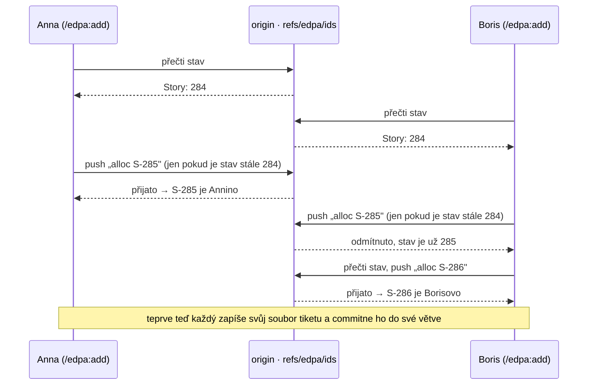

# Přechod na rezervaci ID tiketů přes git remote — návod na jednu stránku

**Proč:** číslo tiketu se dosud bralo z čítače v pracovním stromu. Dva lidé (nebo dva klony)
tak dostali stejné `S-285` a zjistili to až při merge; tikety se proto pouštěly přes vlastní PR
jen kvůli „zabrání čísla". Nově číslo přiděluje sdílený git remote.

## Jak to funguje



- Formát `S-285` se nemění. Žádné GitHub API, žádné `gh` — jen `git fetch` a `git push` jednoho
  servisního commitu do refu `refs/edpa/ids`. Váš kód se tím nikdy nepushuje.
- Soubor tiketu dál cestuje s vaší větví. Rezervuje se jen číslo.
- Hooky pustí jen tiket, který má v ledgeru rezervaci.

## Kroky přechodu

| # | Krok | Kdo | Dopad na tým |
|---|---|---|---|
| 1 | Sloučit změnu do EDPA (`main`) | maintainer EDPA | žádný |
| 2 | Zkouška v repu EDPA: `init-remote`, commit, pár tiketů ze dvou worktree | maintainer EDPA | žádný |
| 3 | Release EDPA (bump verze, changelog, web, tag) — bez nové verze se engine v projektech neaktualizuje | maintainer EDPA | žádný, dokud si plugin neaktualizujete |
| 4 | **Všichni:** `/plugin update`, restart session, pushnout rozpracované větve s tikety | celý tým | ~5 minut |
| 5 | V projektu: `init-remote --write-config` a PR s jedním řádkem `ids.authority: remote` | maintainer projektu | od teď platí nový režim |
| 6 | Kontrola: `id_counter.py status` a `id_counter.py doctor` | kdokoli | — |

```bash
# krok 5 (jednou na repozitář, z nejúplnějšího klonu)
python3 .edpa/engine/scripts/id_counter.py init-remote --write-config
git add .edpa/config/edpa.yaml
git commit -m "chore(no-ticket): reserve ticket IDs in the shared ledger"

# krok 6
python3 .edpa/engine/scripts/id_counter.py status --refresh
python3 .edpa/engine/scripts/id_counter.py doctor
```

**Kdy:** na hranici iterace nebo ve chvíli klidu, až mají všichni nový plugin a pushnuté větve.

## Co se pro vás změní po kroku 5

- Založení tiketu trvá asi 2 s a potřebuje síť a právo pushovat do repa.
- Váš klon se přepne sám při nejbližším `git fetch` / `git pull` — nic nenastavujete.
  Všechny worktree jednoho klonu se přepnou najednou.
- Tiket napsaný ručně nebo vyražený starým pluginem zastaví hook při commitu nebo pushi.
  Tikety zakládejte vždy přes `/edpa:add`.
- Číslování plynule pokračuje (žádná rezerva ani díry v řadě). Proto musí mít
  před krokem 5 všichni nový plugin — kdo by ještě razil čísla po staru, toho zastaví hook a
  tiket si založí znovu.
- `id_counters.yaml` se přestane přepisovat, takže na něm přestanou vznikat konflikty.
- Máte ve větvi tiket z doby před přepnutím se stejným číslem jako někdo jiný? Postup je stejný
  jako dřív: `python3 .edpa/engine/scripts/renumber_collisions.py --apply`. Nové číslo už přijde
  z ledgeru.

## Když to řekne ne

| Hláška | Co udělat |
|---|---|
| `the ID ledger … does not exist yet` | maintainer ještě nespustil `init-remote` |
| `cannot reach the ID ledger` | síť / přihlášení ke gitu; nic se nezapsalo, zkuste znovu |
| `has no reservation in the ID ledger` | tiket nevznikl přes `/edpa:add` nebo máte starý plugin — aktualizujte a založte ho znovu |
| `does not let this environment update the ID ledger` | prostředí nesmí pushovat (sandbox, fork) — založte tiket z běžného klonu |

**Bez sítě:** vezměte si čísla předem, `id_counter.py reserve --type Story --count 5`.

**Návrat zpět:** `ids.authority: local` v `.edpa/config/edpa.yaml`. Vydaná čísla zůstávají platná.

Jak to funguje uvnitř gitu: [id-ledger.md](id-ledger.md) · provoz: [dev-collisions.md](dev-collisions.md) · rozhodnutí:
[ADR-014](v2/decisions.md#adr-014-remote-coordinated-identity--id-ledger-na-git-refu)
